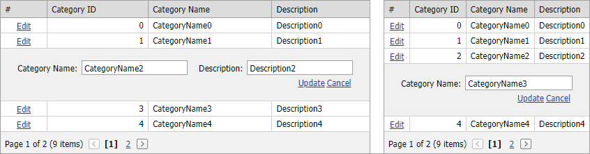

<!-- default badges list -->

[](https://supportcenter.devexpress.com/ticket/details/E4999)
[](https://docs.devexpress.com/GeneralInformation/403183)
<!-- default badges end -->
# Grid View for ASP.NET Web Forms - How to hide the EditForm editor and column caption programmatically


In this example, the edit form hides an editor for the **Description** column if the current row's category name meets certain conditions.



## Implementation Details

Specify the [EditFormSettings.Visible](https://docs.devexpress.com/AspNet/DevExpress.Web.GridColumnEditFormSettings.Visible) property value in the [BeforeGetCallbackResult](https://docs.devexpress.com/AspNet/DevExpress.Web.ASPxGridBase.BeforeGetCallbackResult) event handler to change an editor's visibility.

```cs
private string[] values = new string[] { "CategoryName1", "CategoryName3", "CategoryName5", "CategoryName7" };
//...
protected void gv_BeforeGetCallbackResult(object sender, EventArgs e) {
    HideEditor(sender as ASPxGridView);
}

private void HideEditor(ASPxGridView gv) {
    if (gv.IsEditing && !gv.IsNewRowEditing) {
        string value = gv.GetRowValues(gv.EditingRowVisibleIndex, "CategoryName").ToString();
        gv.DataColumns["Description"].EditFormSettings.Visible = values.Contains(value) ? DefaultBoolean.False : DefaultBoolean.True;
    }
}
```

## Files to Look At

- [Default.aspx.cs](./CS/Solution/Default.aspx.cs) (VB: [Default.aspx.vb](./VB/Solution/Default.aspx.vb))
## More Examples

- [GridView for Web Forms - How to adjust Edit Form layout using the EditFormLayoutProperties property](https://github.com/DevExpress-Examples/aspxgridview-how-to-adjust-edit-form-layout-using-the-editformlayoutproperties-property-t285676)
